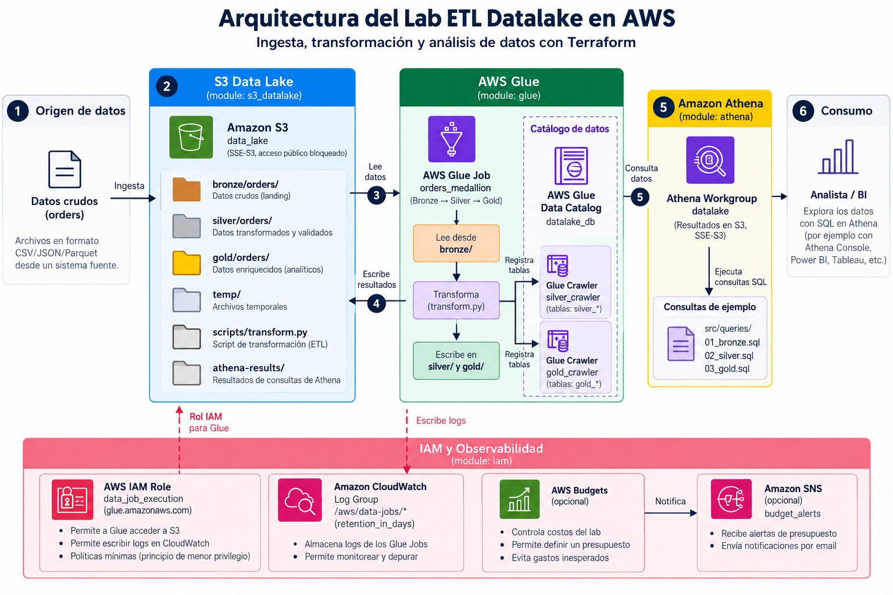

# Laboratorio ETL Serverless y Data Lake con AWS

Este repositorio es la implementación en código (Terraform + PySpark +
SQL) del laboratorio de la sesión 4 del bootcamp de Data Engineering. Si
nunca has trabajado con un Data Lake en AWS, este README te explica los
conceptos a medida que recorres el proyecto — no necesitas saber Glue,
Athena o Terraform de antemano.

## El problema que resuelve este laboratorio

Una empresa recibe pedidos (`orders`) todos los días en archivos CSV
crudos. Con el tiempo, surgen tres necesidades típicas de cualquier
equipo de datos:

1. **Conservar los datos originales** sin modificarlos, por si hay que
   reprocesar o auditar.
2. **Limpiar y estandarizar** esos datos (quitar duplicados, corregir
   tipos, descartar filas inválidas) antes de que alguien los analice.
3. **Preparar datos listos para consumo** (agregaciones, métricas) para
   que un analista o un dashboard los consulte sin tener que repetir la
   limpieza cada vez.

La arquitectura que resuelve esto se llama **medallion**: tres capas
llamadas Bronze, Silver y Gold.



*Fuente editable del diagrama: [docs/assets/architecture.dot](docs/assets/architecture.dot).*

| Capa | Qué contiene | Por qué existe |
|---|---|---|
| **Bronze** | Los datos crudos, tal como llegaron. | Nunca se sobrescriben ni se limpian in-place: si algo sale mal en Silver/Gold, siempre puedes volver a procesar desde el original. |
| **Silver** | Los mismos datos, limpios: tipos correctos, sin duplicados, sin valores inválidos. | Es la "fuente de verdad" confiable — cualquiera puede consultarla sin preocuparse por basura en los datos. |
| **Gold** | Datos agregados, listos para análisis (ej. ventas por ciudad y fecha). | Un analista de negocio no necesita re-calcular agregaciones cada vez que abre un dashboard. |

## Los servicios de AWS involucrados, y para qué sirve cada uno

Si es tu primera vez con estos servicios, esta tabla resume el rol de
cada uno en el pipeline — profundiza en cada concepto según avances por
las guías de la siguiente sección.

| Servicio | Rol en este laboratorio |
|---|---|
| **Terraform** | Crea toda la infraestructura de AWS de forma reproducible (S3, IAM, Glue, Athena) a partir de código versionado, en vez de clics manuales en la consola. |
| **Amazon S3** | Almacena físicamente los archivos de las tres capas (Bronze/Silver/Gold) como objetos dentro de un bucket. |
| **AWS Glue Job** | Ejecuta el código PySpark (`src/glue/transform.py`) que transforma Bronze → Silver → Gold. Es "el ETL" en sí. |
| **AWS Glue Crawler** | Escanea los archivos Parquet en S3 y genera automáticamente el catálogo de metadata (nombres de columnas, tipos, particiones) — sin esto, Athena no sabría qué hay en esos archivos. |
| **AWS Glue Data Catalog** | El "diccionario" de tablas: qué columnas tiene `silver_orders`, dónde vive en S3, cómo está particionada `gold_orders`. Lo llenan los Crawlers. |
| **Amazon Athena** | Motor de consultas SQL que lee directamente los archivos en S3 usando el catálogo de Glue — no hay una base de datos tradicional detrás, los datos siguen viviendo en S3 (concepto de *schema-on-read*). |

Un concepto clave para el examen de certificación y para este lab:
**Glue Job vs Glue Crawler no son lo mismo**. El Job *transforma* datos
(ejecuta código). El Crawler *descubre* metadata (no toca ni cambia los
datos). Verás esta distinción puesta a prueba en los challenges del
enunciado del laboratorio.

> **Nota sobre Lake Formation:** el enunciado del laboratorio
> (`docs/sesion_04_laboratorio_challenges.md`) incluye conceptos de AWS
> Lake Formation (gobierno de permisos sobre el Data Lake, más allá de
> IAM). Este stack de Terraform **no despliega Lake Formation** — queda
> como ejercicio conceptual del enunciado, no como infraestructura de
> este repo. No busques recursos de Lake Formation en la consola después
> de desplegar; no existen aquí.

## Por dónde empezar

Sigue este orden — cada paso te lleva a una guía más detallada:

1. **Lee el enunciado completo del laboratorio**:
   [docs/sesion_04_laboratorio_challenges.md](docs/sesion_04_laboratorio_challenges.md)
   — contiene el caso de negocio completo, los conceptos que debes
   entender (medallion, partition pruning, Athena Federated Query,
   Lake Formation) y los challenges que debes poder responder al final.
   Léelo antes de tocar código: te da el "por qué" de cada decisión que
   verás en `infra/` y `src/`.
2. **Despliega la infraestructura**:
   [docs/despliegue_infra_terraform.md](docs/despliegue_infra_terraform.md)
   — paso a paso de `terraform init/plan/apply`. Incluye problemas reales
   que aparecieron construyendo este stack contra AWS real (no solo la
   teoría) y cómo se diagnosticaron — útil para cuando a ti te pase algo
   parecido.
3. **Ejecuta el pipeline y valida el resultado.** Tienes dos guías según
   tu preferencia:
   - [docs/prueba_manual_consola_aws.md](docs/prueba_manual_consola_aws.md)
     — **recomendada si es tu primera vez**: todo por clics en la consola
     web de AWS, sin ningún comando de terminal. Ideal para ver
     visualmente qué hace cada servicio.
   - [docs/prueba_manual_pipeline.md](docs/prueba_manual_pipeline.md) —
     los mismos pasos, con la alternativa de AWS CLI para repetirlos
     rápido una vez que ya entiendes el flujo.
4. **Vuelve al enunciado del laboratorio** y responde los challenges
   (Parte 16 en adelante) contra tu propio despliegue — el objetivo no es
   que "funcione", es que puedas explicar por qué existe cada componente.

## Qué hay en este repo

| Ruta | Qué es |
|---|---|
| `infra/` | Terraform, modularizado por servicio en `infra/modules/`: `s3_datalake` (bucket + prefijos bronze/silver/gold/temp), `iam` (rol de ejecución, CloudWatch Logs, budget), `glue` (database, job, crawlers), `athena` (workgroup). La raíz de `infra/` solo orquesta los módulos. |
| `src/glue/transform.py` | El script PySpark que ejecuta el Glue Job: limpia y deduplica Bronze → Silver, agrega Silver → Gold. Es el corazón del ETL — vale la pena leerlo completo. |
| `src/queries/` | Queries SQL de referencia para pegar en Athena (`01_bronze.sql`, `02_silver.sql`, `03_gold.sql`). |
| `data/orders.csv` | Dataset sintético de ejemplo (pedidos), con duplicados y valores inválidos a propósito — así ves que la limpieza de Silver realmente hace algo. |
| `scripts/generate_orders_dataset.py` | Genera un dataset nuevo cada vez que lo corres (ver sección siguiente). |
| `tests/aws/test_datalake_e2e.py` | Un test automatizado que corre el pipeline completo contra AWS real. Útil para verificar rápido que todo sigue funcionando, no para aprender (para eso están las guías manuales). |
| `docs/` | Todas las guías mencionadas arriba, más el historial de diseño con los incidentes reales encontrados al construir este stack. |

## El dataset de ejemplo: `orders`

Columnas: `order_id, customer_id, order_date, status, amount, city,
carrier`. El CSV de ejemplo (`data/orders.csv`) tiene 40 filas base + 2
duplicados intencionales (mismo `order_id`, fecha posterior — simula un
pedido re-enviado) y algunas filas con `amount` inválido o vacío. Esto es
deliberado: si Silver simplemente copiara Bronze sin cambios, no
aprenderías nada — con datos "sucios" puedes *verificar* que la limpieza
ocurrió (menos filas en Silver que en Bronze, sin duplicados, sin montos
inválidos).

### Generar tu propio dataset

Por defecto, `scripts/generate_orders_dataset.py` genera un archivo
**nuevo cada vez que lo ejecutas** (sin necesidad de pasar ningún
argumento — funciona igual si lo corres desde la terminal o con el botón
"Run" de tu IDE):

```bash
uv run python scripts/generate_orders_dataset.py
# → escribe a data/orders-<timestamp>.csv, listo para subir a su propio origen
```

Si en cambio necesitas el dataset **fijo y determinista** del que depende
el test automatizado (`tests/aws/test_datalake_e2e.py`), pide
explícitamente `--fixed`:

```bash
uv run python scripts/generate_orders_dataset.py --fixed
# → siempre regenera exactamente data/orders.csv, con los mismos duplicados
```

También puedes personalizar cuántas filas genera o fijar un seed
concreto:

```bash
uv run python scripts/generate_orders_dataset.py --rows 100 --seed 7 --out data/orders_grande.csv
```

## Probar que todo funciona

Después de desplegar la infraestructura, tienes dos formas de validar el
pipeline:

**Manual, paso a paso** (la forma en que aprendes qué hace cada
servicio): sigue
[docs/prueba_manual_consola_aws.md](docs/prueba_manual_consola_aws.md)
(solo consola) o
[docs/prueba_manual_pipeline.md](docs/prueba_manual_pipeline.md)
(consola + CLI).

**Automatizado** (rápido, pero no reemplaza entender cada paso):

```bash
set -a
source .env.credentials
set +a
uv run python -m pytest tests/aws/test_datalake_e2e.py -m cloud -v -s
```

Este test sube un dataset real, corre el Glue Job real, corre los
Crawlers reales, y valida con queries Athena reales que Silver deduplicó
correctamente y que Gold reconcilia con Silver. No es un smoke test — es
una ejecución real con costo real (Glue DPU-hours, datos escaneados por
Athena). Tarda entre 4 y 6 minutos.

**¿Vas a subir un dataset adicional después de ya haber corrido el
pipeline una vez?** Athena no verá las particiones nuevas de
`gold_orders` hasta reparar el catálogo — ver
[docs/reparar_particiones_athena.md](docs/reparar_particiones_athena.md).

## Convenciones del proyecto

Este repo sigue el contrato definido en [AGENTS.md](AGENTS.md): Terraform
modularizado por servicio dentro de `infra/modules/`, SQL separado de Python,
configuración sobre valores hardcodeados, y aprobación explícita antes de
cualquier `terraform apply`/`destroy` real (nunca lo ejecutes sin
entender qué va a crear o destruir). Para dependencias Python se usa
[`uv`](https://docs.astral.sh/uv/): `uv sync` para instalar, `uv run`
para ejecutar cualquier script o test.

## Cuando algo falla

Construir este stack contra AWS real (no solo en teoría) expuso varios
problemas que probablemente encontrarás tú también si experimentas con tu
propio despliegue: condiciones de carrera al crear roles IAM, un Crawler
que le pone nombres impredecibles a las tablas si no se configura bien
(dos crawlers separados en vez de uno con dos rutas), y un tipo de
columna de partición que rompe una query si no usas comillas. Estos casos
están documentados con el error exacto y la solución, como notas
"Insight", dentro de
[docs/despliegue_infra_terraform.md](docs/despliegue_infra_terraform.md)
— revísalo si algo no funciona como esperas, antes de asumir que rompiste
algo tú.
